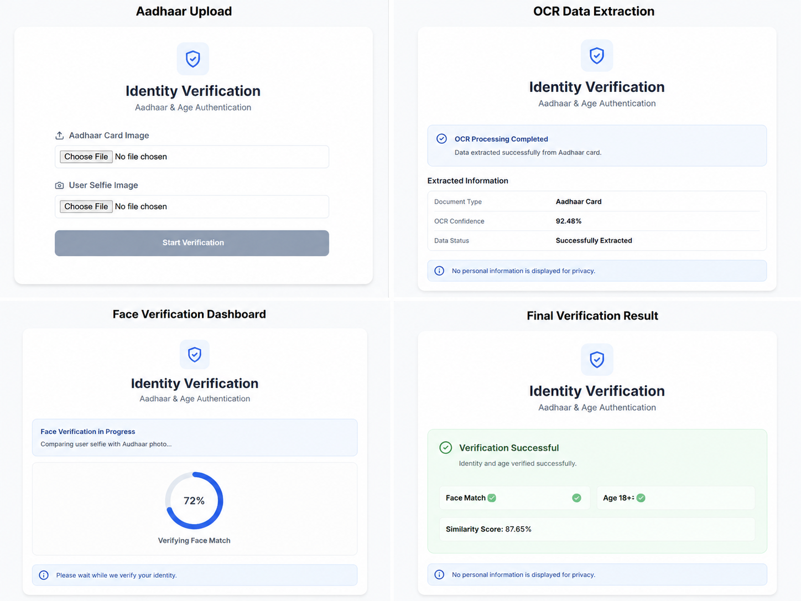

# 🔐 Aadhaar-Based Identity & Age Verification System

An AI-powered identity verification platform that combines **Facial Recognition**, **OCR-based Aadhaar Parsing**, and **Automated Eligibility Validation** to perform secure real-time user verification.


## ✨ Features

✅ Aadhaar OCR Extraction using Tesseract OCR

✅ Real-Time Facial Verification using FaceNet

✅ Automated Age Calculation & Validation

✅ 18+ Compliance & Eligibility Checks

✅ Confidence Score-Based Decision Making

✅ Interactive Streamlit Dashboard

✅ Verification Reports & Audit Logs

---

## 🎯 Problem Statement

Traditional identity verification processes are often manual, slow, and prone to human error. This project automates identity and age verification using AI-powered document understanding and biometric authentication.

---

## 🏗️ System Workflow

```text
┌─────────────────┐
│ Upload Aadhaar  │
└────────┬────────┘
         │
         ▼
┌─────────────────┐
│ OCR Extraction  │
└────────┬────────┘
         │
         ▼
┌─────────────────┐
│ Face Detection  │
└────────┬────────┘
         │
         ▼
┌─────────────────┐
│ FaceNet Matching│
└────────┬────────┘
         │
         ▼
┌─────────────────┐
│ Age Validation  │
└────────┬────────┘
         │
         ▼
┌─────────────────┐
│ Verification    │
│ Decision        │
└─────────────────┘
```

## 🧠 Tech Stack

| Technology     | Purpose                   |
| -------------- | ------------------------- |
| Python         | Backend Development       |
| PyTorch        | Deep Learning Framework   |
| FaceNet        | Facial Recognition        |
| OpenCV         | Image Processing          |
| Tesseract OCR  | Aadhaar Text Extraction   |
| Streamlit      | Interactive Web Interface |
| NumPy & Pandas | Data Processing           |

---

## 📊 Model Performance

| Metric                       | Score       |
| ---------------------------- | ----------- |
| Face Verification Accuracy   | 95%+        |
| OCR Extraction Accuracy      | 92%+        |
| Processing Time              | < 3 Seconds |
| Eligibility Checks Automated | 18+         |

---

## 🔍 Verification Checks

* Identity Match Verification
* Age Eligibility Validation
* Aadhaar Data Completeness Check
* Duplicate User Detection
* Face Similarity Threshold Validation
* Gender Consistency Validation
* Consent Verification
* Compliance Rule Validation

---


### Final Verification Result



## 📈 Team Members
-Tanya Sharma, Yashika Mann, Shreya Ruhela

Built for Zynga Hackathon 2025
(IGDTUW)


---

## 👨‍💻 Author

Developed as an AI-powered Identity Verification solution demonstrating practical applications of Computer Vision, Deep Learning, and OCR in compliance-sensitive environments.
